# Skooper
Welcome to the 4 days rush to pull this off, here's the finished work

## Model

## State machine

## Resources
### Frontend
#### Languages

#### Tools

#### Libraries
**None, all pure** *HTML + CSS + JS*

### Backend
#### Languages

#### Tools

#### Libraries
- adafruit/Adafruit Unified Sensor
- adafruit/Adafruit BME280 Library
- ottowinter/ESPAsyncWebServer-esphome
